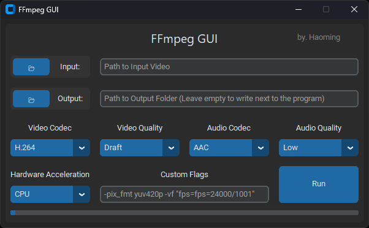

# FFmpeg GUI
A simple User Interface for [FFmpeg](https://ffmpeg.org/), built on [CustomTkinter](https://github.com/TomSchimansky/CustomTkinter)

> Mainly written for Windows with Nvidia GPU

## Requirements
- [FFmpeg](https://ffmpeg.org/download.html)
    - Remember to add the `bin` folder to `PATH`
    - Installing the **full** build is recommended

<i> Wrote this program mainly as an excuse to practice CustomTkinter :P </i>
